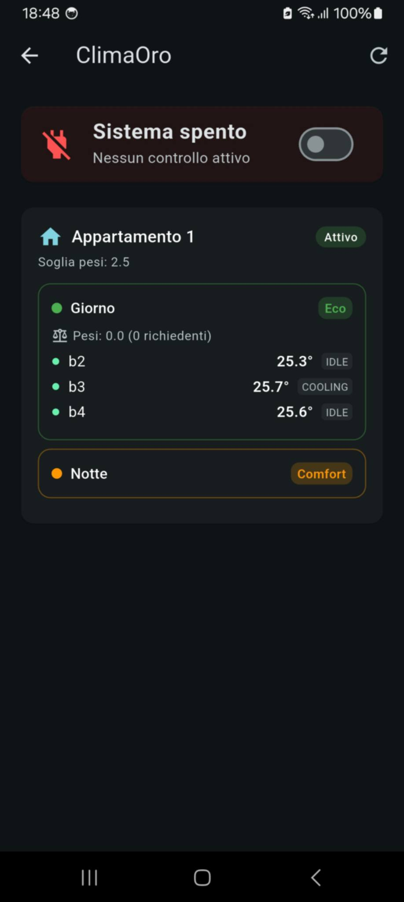

# CLIMAORO App
**L'interfaccia mobile nativa per la gestione diretta e centralizzata del riscaldamento.**

---

## Links

- **Sito web:** [https://UVAVIVA.github.io/CLIMAORO/](https://UVAVIVA.github.io/CLIMAORO/)
- **Progetto principale:** [https://github.com/UVAVIVA/CLIMAORO](https://github.com/UVAVIVA/CLIMAORO)

---

## La Visione

Nelle prime versioni di CLIMAORO, l'unico modo per interagire con il sistema era rappresentato dalle dashboard di Home Assistant. Sebbene complete, le schermate risultavano affollate, complesse da navigare da smartphone e prive dell'immediata reattività richiesta nell'uso quotidiano.

Il riscaldamento incide per il 60-70% sui consumi energetici di un'abitazione: merita un'interfaccia dedicata, essenziale ed efficace.

**CLIMAORO App** nasce con un obiettivo preciso: eliminare la dipendenza da server centrali o interfacce generiche per offrire un controllo immediato direttamente da telefono. L'applicazione dialoga via Wi-Fi locale direttamente con i termostati ESPHome e con il motore C, garantendo un'esperienza rapida, pulita e sempre disponibile.

---

## Struttura dell'Applicazione

L'esperienza utente è organizzata in sezioni focalizzate e prive di distrazioni:

| Schermata | Descrizione |
| --- | --- |
| **Dashboard Generale** | Panoramica sintetica di tutti i termostati di casa: temperatura corrente, umidità relativa, stato operativo (accesso/spento) e stato di connettività in tempo reale. |
| **Controllo Singolo Termostato** | Gestione puntuale della singola stanza: cambio setpoint, accensione/spegnimento e selezione modalità HVAC (*Caldo*, *Fresco*, *Automatico*, *Deumidificazione*, *Ventilazione*). |
| **Pannello ClimaOro** | Il centro di controllo dell'algoritmo: gestione appartamenti, aggregazione stanze in gruppi, definizione dei pesi e matrice oraria settimanale (*Comfort*, *Eco*, *Autonomo*), oltre al selettore Master. |
| **Automazioni & Notifiche** | Configurazione di regole condizionali locali (es. attivazione al di sotto di soglie critiche) e ricezione di notifiche push sugli eventi di sistema. |

 

---

## Scelte Tecnologiche

- **Flutter Framework**: Codice sorgente unificato per un'esperienza d'uso fluida, nativa e performante su dispositivi mobili.
- **Comunicazione REST / HTTP Diretta**: L'applicazione sfrutta i web server nativi dei singoli ESPHome e le API REST del motore C. Nessun protocollo esotico o middleware intermedio.
- **Operatività Standalone**: Se il motore centralizzato non è configurato o temporaneamente irraggiungibile, l'app continua a interagire direttamente con i singoli termostati senza bloccare l'impianto.

 

---

## Installazione e Avvio

1. **Istruzioni di installazione:** [Apri le istruzioni](https://github.com/UVAVIVA/climaoro-app/blob/main/ISTRUZIONI.md)
2. **Installazione**: Distribuzione diretta tramite pacchetto **APK** (abilitando l'installazione da sorgenti sconosciute sul dispositivo Android se richiesto).
3. **Prima Configurazione**: Al primo avvio viene richiesto l'indirizzo IP del motore CLIMAORO. In seguito i termostati vanno **inseriti manualmente tramite il loro indirizzo IP**.

---

## Licenza e Responsabilità

**CLIMAORO © 2026 by UVAVIVA** · Licenza: **MIT con Condizione di Attribuzione**

**Termini**
- ✅ Attribuzione richiesta (nel codice e sui dispositivi commerciali)
- ✅ Uso commerciale permesso (con attribuzione)
- ✅ Modifiche e derivati permessi
- ✅ Uso, copia, distribuzione e vendita permessi

**Disclaimer**
Questo progetto è fornito **così com'è**, a scopo educativo e sperimentale.
- ⚠️ Non certificato per uso produttivo
- ⚠️ Nessuna garanzia di alcun tipo
- ⚠️ L'utente si assume ogni rischio relativo all'uso del software e al rispetto delle normative locali

**Sviluppato da:** [UVAVIVA](https://github.com/UVAVIVA)

---

**Costruito con passione, dal nulla.**
